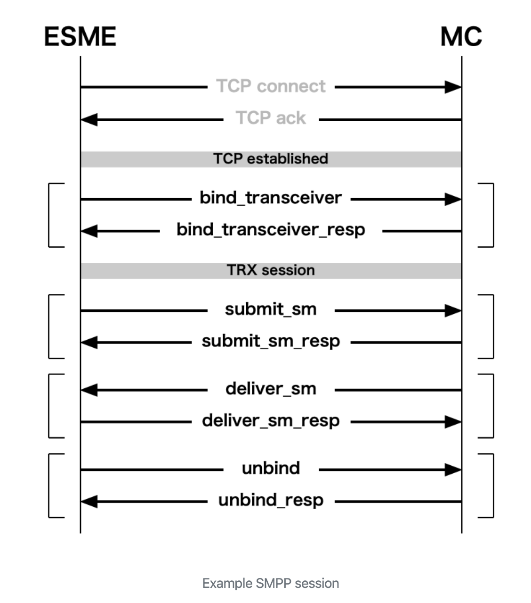

SMPP Kafka Producer
===================

This is a Kafka Producer that reads SMPP protocol messages, and publishes to Kafka topics.

The SMPP (Short Message Peer-to-Peer) protocol is an open, 
industry standard protocol designed to provide a flexible data 
communications interface for the transfer of short message data 
between External Short Message Entities (ESME), Routing Entities (RE) 
and Message Centres (MC). It is a means by which applications can send 
SMS messages to mobile devices and receive SMS from mobile devices. 

This is done using an SMPP connection with a Short Message Service Center 
(SMSC), SMS gateway, SMPP gateway or hub.

Supports SMPP versions 3.x and 5 

[Read More about SMPP Protocol][1]

Pre-requisites
--
- [Install Kafka][2] 
- [SMPP Server Emulator][3]

Additionally, you can write your re-use the test server under `com.subhadipmitra.code.module.ServerMainTest`

SMS and Kafka Payloads
--
You may want to update the object mappers for the SMS text and Kafka JSON payload.

Update `com.subhadipmitra.code.module.models`

Compile and Run
--
1. Clone Repository
`git clone https://github.com/bassrehab/smpp-kafka-producer.git`
2. Change Folder
`cd smpp-kafka-producer`
3. Optional, upgrade dependencies
`mvn versions:display-dependency-updates`
4. Compile
`mvn clean package`
5. Update  Kafka Configs (Update Kafka for SASL/SSL configs)
`settings/config.properties`

6. Update SMPP Server Configs
`settings/context.xml`
7. Output Directory
`out/smpp-producer`
8. Run
`sh run.sh`

License
--
Read LICENSE.md

[1]: https://smpp.org/ "SMPP Webpage"

[2]: https://kafka.apache.org/quickstart "kafka quickstart"

[3]: https://smscarrier.com/smsc-simulator/ "smpp server emulator"
